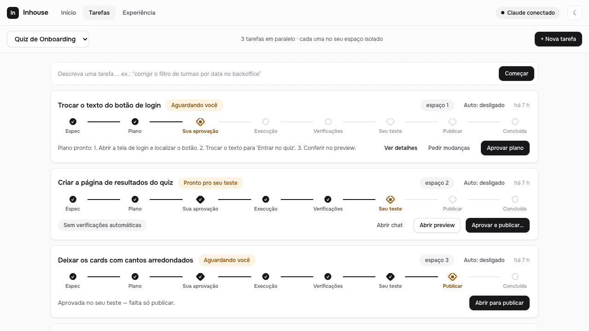
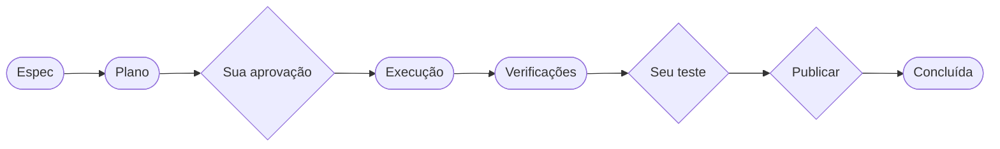

<div align="center">

# 🏠 Inhouse

### Crie e altere apps conversando em português — sem terminal, sem chave de API.

Um **construtor de apps local** que coloca o Claude Code da _sua própria máquina_ (a sua
assinatura) numa esteira de tarefas com **porteiras humanas**, para pessoas não-técnicas
mexerem em código com segurança. Você descreve o que quer; o Claude planeja, executa,
testa e abre um Pull Request. Você só aprova nos pontos que importam.




</div>

---

## Por que ele existe

Ferramentas de IA que constroem apps ou usam uma **chave de API que você paga por token**,
ou mandam o seu código para um servidor de terceiros. O Inhouse faz diferente:

- 🔒 **Roda com a _sua_ assinatura do Claude.** Ele orquestra o binário `claude` que já está
  na sua máquina — nunca uma API key. Nada sai do seu computador além da conversa com o Claude.
- 🗣️ **Tudo em português, sem terminal.** Você descreve a tarefa numa frase. Quem usa não
  precisa saber o que é branch, worktree ou PR.
- 🧱 **Cada tarefa num espaço isolado.** Várias tarefas rodam em paralelo, cada uma no seu
  próprio `git worktree` — sem uma atrapalhar a outra.
- 🚦 **Porteiras humanas.** Nada vai para o ar sem o seu "ok". Publicar vira um **Pull Request**
  revisável — nunca um merge direto no `main`.

## Como funciona: a esteira

Cada tarefa percorre estes passos. Os **losangos são porteiras** — a tarefa te espera nelas.



- **Espec / Plano** — o Claude estrutura o pedido e monta um plano em português simples.
- **Sua aprovação** — você lê o plano e aprova (ou pede mudanças).
- **Execução** — o Claude faz a mudança no espaço isolado da tarefa.
- **Verificações** — typecheck, lint e testes detectados no projeto rodam como _gate_
  determinístico. Código quebrado não passa; o Claude recebe os erros e tenta corrigir.
- **Seu teste** — você abre o **preview** do app rodando e confere.
- **Publicar** — abre um Pull Request no GitHub para o time revisar.

## Começando

**Você precisa de:**

1. **Node 24+**
2. **Claude Code logado** (plano Pro/Max) — abra o terminal, rode `claude` e faça o login
3. **git** (e `gh` logado, se quiser abrir Pull Requests)

**Rodar:**

```bash
git clone https://github.com/marlonwlv/inhouse
cd inhouse
npm install
npm start
# abra http://127.0.0.1:4400
```

**No Mac, sem terminal:** dê um duplo-clique em **`setup.command`** (prepara a máquina) e
depois em **`inhouse.command`** (abre o app no navegador).

## O que dá para fazer

- **Abrir** um repositório do GitHub ou **criar** um app novo a partir do template embutido.
- **Descrever** tarefas em português e acompanhar cada uma percorrendo a esteira.
- **Ver a mudança no preview** — o Inhouse sobe o dev server do projeto numa porta própria
  (auto-detecta o gerenciador e o framework; se não conseguir, o próprio Claude descobre como).
- **Publicar** como um Pull Request revisável.
- **Experiência** — o Inhouse mede sozinho os atritos de quem usa e ranqueia o que melhorar.

## Ideias-chave

| | |
|---|---|
| **Sua assinatura, nunca API key** | O SDK aponta para o `claude` da máquina; o ambiente é servido sem `ANTHROPIC_API_KEY`. |
| **Espaços isolados** | Cada tarefa é um `git worktree` — a palavra nunca aparece na interface. |
| **Publicar = Pull Request** | Em repositórios com origin, publicar empurra a branch e abre um PR; nunca mexe no `main`. |
| **Preview genérico** | Convenção + configuração + o agente descobrindo a receita + degradação graciosa. |
| **Só local** | Escuta apenas em `127.0.0.1`. Estado em `~/.inhouse`, projetos em `~/Inhouse`. Sem telemetria. |

## Arquitetura

Servidor **Node 24 + TypeScript (ESM)** com Express + SSE, UI **vanilla** (sem build), estado
em `state.json` + transcripts JSONL. O Claude entra via `@anthropic-ai/claude-agent-sdk`
apontando para o binário `claude` local. Os detalhes e as decisões estão em
**[`ARCHITECTURE.md`](ARCHITECTURE.md)**.

```bash
npm run dev        # servidor com reload (tsx watch)
npm run typecheck  # tsc --noEmit
npm test           # vitest (Claude mockado)
```

## Status

Projeto novo, em evolução. Nasceu como ferramenta interna e virou open source. É pensado de
propósito para pessoas **não-técnicas**, e por isso a interface e o vocabulário são todos em
**pt-BR**. Issues e Pull Requests são bem-vindos.

## Licença

[MIT](LICENSE) — use, modifique e compartilhe à vontade.

<div align="center"><sub>Feito com o Claude Code.</sub></div>
